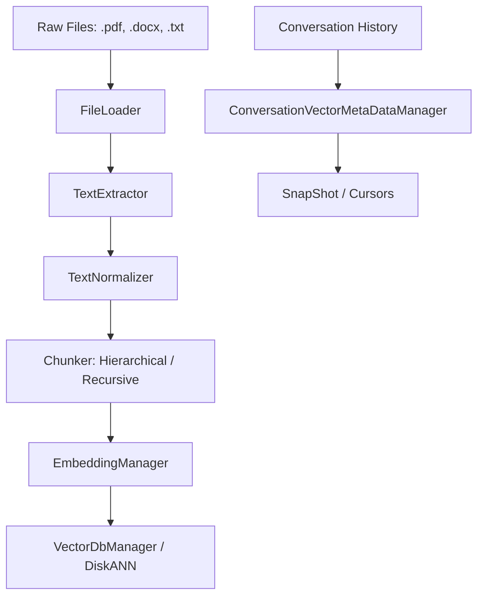

# Final Year Project Backend API Documentation

Welcome to the official API documentation for the **Final Year Project Backend Application**. This documentation suite provides detailed overviews, architectural workflows, class structures, parameter definitions, and public API descriptions for every module and submodule in the project.

## Table of Contents

### 1. Core Configuration & CLI Interface
- [Configuration (`config.py`)](file:///home/ajay/Documents/final_year_project/backend/app/docs/config.md)
  - Centralized application settings (`Config`) and standardized logging (`get_logger`).
- [Main Application Entrypoint (`main.py`)](file:///home/ajay/Documents/final_year_project/backend/app/docs/main.md)
  - Startup initialization and execution mode orchestration.
- [Interactive CLI Interface (`cli_interface.py`)](file:///home/ajay/Documents/final_year_project/backend/app/docs/cli_interface.md)
  - Command-line interaction session manager (`InteractiveCLI`).

### 2. Data Layer: Ingestion & Text Processing
- [Text File Processing (`FileLoader` & `TextExtractor`)](file:///home/ajay/Documents/final_year_project/backend/app/docs/text_file_processor.md)
  - Directory scanning and multi-format text extraction (`.txt`, `.pdf`, `.docx`, `.doc`, `.md`).
- [Text Normalizer (`TextNormalizer` & `NormalizationProfiles`)](file:///home/ajay/Documents/final_year_project/backend/app/docs/normalizer.md)
  - Text cleaning, regex-based section detection, URL/email replacement, and newline structuring.
- [Nodes & Metadata Structures (`nodes.py` & `metadata.py`)](file:///home/ajay/Documents/final_year_project/backend/app/docs/nodes_and_metadata.md)
  - Immutable dataclasses representing documents, sections, contexts, chunks, normalized content, and vector embeddings along with their metadata.
- [Chunking Algorithms & DB Manager (`Chunker`)](file:///home/ajay/Documents/final_year_project/backend/app/docs/chunkers.md)
  - High-level orchestration (`Chunker`), section/paragraph-aware hierarchical chunking (`HierarchicalChunker`), separator-based recursive chunking (`RecursiveChunker`), and SQLite storage (`Manager`).
- [Embedding Manager (`EmbeddingManager`)](file:///home/ajay/Documents/final_year_project/backend/app/docs/embedding_manager.md)
  - Transformer-based vector encoding (`sentence-transformers`) for hierarchical and recursive chunks.
- [Unified Ingestion Pipeline (`IngestionPipeline`)](file:///home/ajay/Documents/final_year_project/backend/app/docs/ingestion_pipeline.md)
  - End-to-end interface wrapping file loading, extraction, normalization, chunking, embedding, and vector insertion.

### 3. Data Layer: Vector Database & Exceptions
- [Vector Database Management (`VectorDbManager` & `VectorDb_diskann`)](file:///home/ajay/Documents/final_year_project/backend/app/docs/vector_db_manager.md)
  - Graph-based approximate nearest neighbor (ANN) vector index management (`DiskANN`).
- [Data Layer Exceptions (`datalayer_exceptions.py`)](file:///home/ajay/Documents/final_year_project/backend/app/docs/datalayer_exceptions.md)
  - Custom domain exceptions for file type validation, vector insertions, index directories, and SQLite operations.

### 4. Memory & Conversation Pool Layer
- [Conversation Vector Metadata Manager (`ConversationVectorMetaDataManager`)](file:///home/ajay/Documents/final_year_project/backend/app/docs/conversation_vector_manager.md)
  - SQLite and memory-mapped vector management for conversational snapshots, summary vectors, and cumulative file offsets.
- [Conversational Snapshots (`SnapShot` & `SnapShotNode`)](file:///home/ajay/Documents/final_year_project/backend/app/docs/snapshot.md)
  - Bidirectional cursor-based snapshot history tracker and cosine similarity search engine.
- [Memory Pool Exceptions (`memory_pool_exceptions.py`)](file:///home/ajay/Documents/final_year_project/backend/app/docs/memory_pool_exceptions.md)
  - Custom exceptions for cursor boundary errors, null pointers, and vector dimensionality validation.

---

## Architectural Workflow Overview

